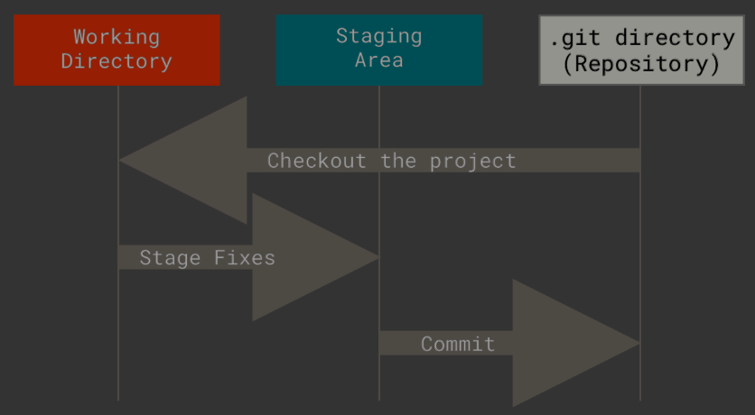

### Git

Git has three main states that your files can reside in: 

1. **modified**: Working directory
2. **staged**: Staging area -> it's the index file located in '.git', it stores information about what will go into your next commit
3. **committed**: .git directory (repository) -> stores the metadata and object database for your project. *(it is what is copied when you clone a repository from another computer)*

- A SHA-1 hash (string of 40 hex digits) identifies each commit made. 

# Referências

**CHACON, Scott; STRAUB, Ben**. Pro Git. 2. ed. Berkeley: Apress, 2014. Acesso em: 17 jul. 2025.

> _Atualizado em: 04/08/2025_