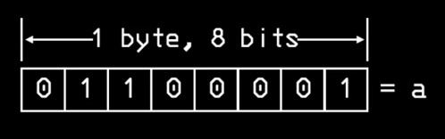
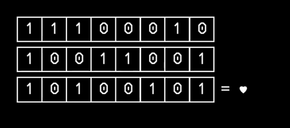
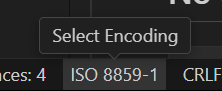
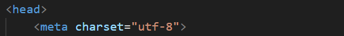

### Codificação de grafemas

Todos os grafemas existentes possuem um código binário exclusivo que o representa. É nessa forma em que eles são **transmitidos** além de **armazenados** no computador. 

Existem vários padrões de codificação de caractere para computadores. Dentre eles vale destacar o ASCII e Unicode -  que usam bytes de 8-bit.

Por meio desses padrões, todo grafema é transformado em bytes.



Obs.: cada byte tem 8 bits e cada bit é um dígito binário.

### ASCII
- American Standard Code for Information Interchange
- Define códigos para 256 grafemas (abrange só o idioma norte-americano)
- o primeiro bit é sempre 0.
- Compatível com o UTF-8: A codificação de caracteres Unicode substitui a codificação ASCII, mas é compatível com versões anteriores do ASCII pois os caracteres ASCII usam a mesma codificação dos primeiros 128 caracteres do UTF-8. Por isso, todos os números e letras romanas existentes cabem em 7-bits.

### Unicode

- Unicode Worldwide Character Standard
- Define códigos para quase 150.000 grafemas (suporta TODOS os grafemas do mundo: letras, números, emojis, ideogramas, etc)
- O primeiro dígito é sempre 1. Todo "1" após ele indica quantos bytes a mais vão ser necessários para o código desse grafema até que alcance o primeiro "0". Depois disso, todo o byte extra sempre começará com "1 | 0 | ...".



## No código

```JavaScript
<head>
<meta charset = "utf-8">
</head>
```

O `<meta charset>` informa ao navegador qual codificação ele deve usar para interpretar os bytes do arquivo.

Veremos o"�" (símbolo de erro) ou caracteres errados quando há conflito entre a forma em que o arquivo está salvo (img. 1) e a codificação declarada no `<meta charset>` (img. 2).

<div style="width: 100%;">
     
     
</div>

