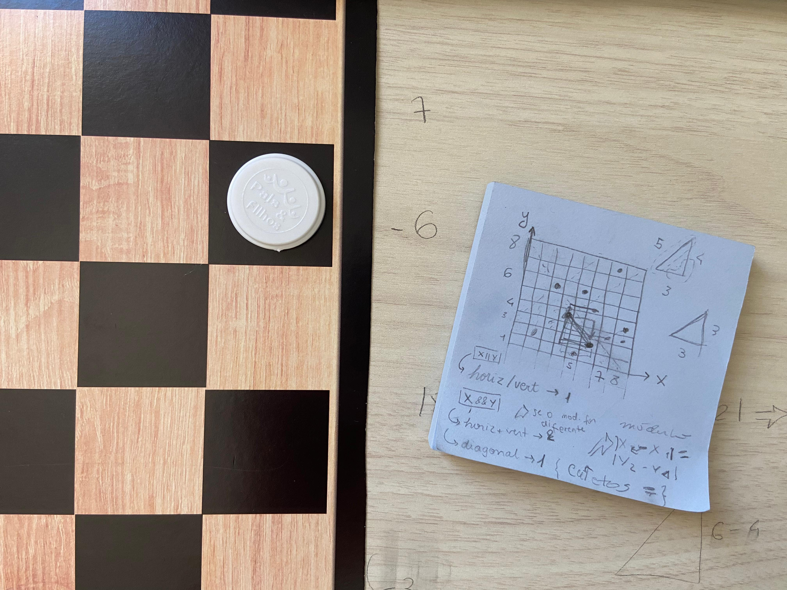

>[Question](https://resources.beecrowd.com/repository/UOJ_1087_en.html) | [My answer](https://github.com/deborangueira/caderno/blob/main/exercicios/1087/script1087.js)

### Understanding the problem 🎯

- Each input's line is a test case with four integers that can range from 1 to 8: "X1 Y1 X2 Y2", where:
    - X1, Y1 is where the queen starts
    - X2, Y2 is where she wants to reach
- the output must be the smallest number of moves needed for the queen to do so.
    - Note: The Queen can move in any direction: in the same **line**, in the same **column** or in any of the **diagonals**
- The end of the input is indicated by a line containing four zeros

### Notes of experience 🫂

The stopping condition was the biggest challenge for me because I initially assumed that the line "0 0 0 0" would always be last one. So I wrote `for (i = 0; i < (lines.length - 1); i++)`, but Beecrowd didn’t accepted it and, later on, this led me to use a `break` statement instead.

I change this part because I understood that the first method I used only checks the number of lines, and that's a problem. Simply put, if it happens to appear extra lines with any kind of content (such as black spaces, extra numbers or text), they would be considered and that would lead to wrong outputs. Using a dynamic stop with `break` instead, lets the program check the actual content and stop **exactly** when the zero line appears. 

This made me realize that we can’t rely on our own assumptions when coding, but instead **we should define precise criterias in everything possible**. By doing so, I could create a code that handled unexpected input variations.

### roadmap 🚩

- Read input (string)
    - separate it by `\n` creating a string for each line of the input, where each one represents a testCase.
        - separate each given string by `" "` creating a new array with four strings.
          - turn them into numbers
          - Store them in variables (with the name indicating the coordinate each one represents)
    - Process function for each line thought a loop -> `for(i =...){}`
        - stops the loop when the line with four zeros is reached -> `if(){break;}`
- print output

*the function*
- compare coordinate X (testCase[0] with testCase[2]) and coordinate Y(testCase[1] with testCase[3]) to see how they differ from each other.
    - if X and Y stay the same -> 0 moves are needed
    - if only X or Y change -> 1 move is needed
    - if both changes and we have a right triangle -> 1 move is needed.
    - for the rest of the cases -> at least 2 moves are needed 
- possible outputs: 0,1,2

  **Code**

    ```Javascript

    function compare(a, b, c, d) {

      if (a === c && b === d) { // se nenhuma coordenada mudar
        return 0; // nenhum movimento é necessário
      } else if (a !== c && b === d || a === c && b !== d || || Math.abs(c - a) === Math.abs(d - b)) { // se apenas uma coordenada mudar (respectivamente x, ou y) ou se um triângulo retângulo se formar (catetos iguais)
        return 1; // um movimento é necessário (horizontal, vertical ou diagonal)
      } else { // para todo o restante dos casos, serão necessários dois movimentos **no mínimo**
        return 2;
      }
    }
    ```

    <div align = 'center'>
    

    <sup>Notes I made when trying to figure out the logic behind the "compare" function, especially how to handle the cases when the queen does a diagonal move. Fun fact: I was in the traffic at that moment, trying hard to write as the car moved rsrs</sup>
    </div>

### How I used IA 🤖

I used ChatGPT occasionally while writing the code for this question.However, my approach with it was to receive guidance and never direct answers so The understanding of the problem and the logic to solve it were developed by myself. To ensure this, I avoided using the tool, and whenever I did, I made sure to include a clear instruction: not to provide any answers related to the solution itself.

Here is the summary of how I got help from it:

- create test cases and correct outputs for me.
- find the function to:
  - use module in a math operation: `Math.abs()`
  - convert a string to a number: `parseInt()` or `Number()`
- Suggested better ways to write parts of the code and explaine the approach (refactoring in essence)
  - that's when I discover the `.every()` function
- Help me identify what I was doing wrong. This happened when I first wrote the "compare" funtion: I didn’t notice I was using = (assignment) instead of === (comparison) to handle with the variables.
  > For learning purposes, I realized I could run more tests using console.log() before asking for help.
- Help me understand whether the 5% error reported by Beecrowd was due to the way it processes code or an actual mistake in my logic.  
  *my prompt*:
    “I finished my code, but Beecrowd is showing a 5% error. Tell me directly: is the issue in how Beecrowd reads my output or is it in my code? If it’s in my code, just say that, don’t give me the answer.”

    <div align = 'center'>
    

    <sup>I first panicked, but this led me to investigate further, and I eventually found the issue in the loop’s stopping condition, so everything is okay now. I liked how this helped me to approach debugging more independently.</sup>
    </div>


### Referências ♻️

**REIS, Ricardo**. Break JavaScript. Medium, 18 mai. 2020. Disponível em: https://ricardo-reis.medium.com/break-9a71e3121803. Acesso em: 24 jul. 2025.

**ROCKETSEAT**. Desestruturação em arrays (parte 01). YouTube, publicado há cerca de sete meses (por volta de dezembro de 2024). Disponível em: https://www.youtube.com/watch?v=WEn6ur8UK1k. Acesso em: 28 jul. 2025.