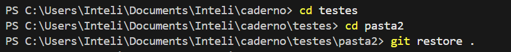
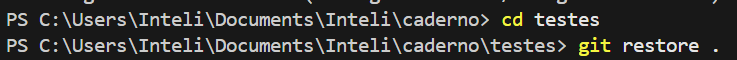
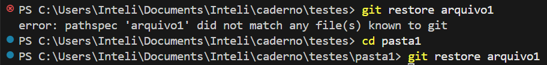
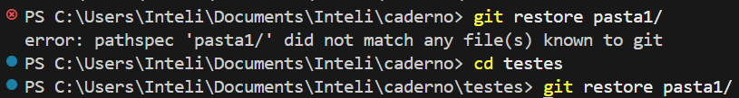

# Comandos via Terminal (PowerShell + VS Code)

> Nesse documento reuni os comandos que mais utilizo para o fluxo de trabalho com Git utilizando terminal do VS Code. Ele foi pensado para ser um documento de consulta, a fim de que não seja mais necessário utilizar o GitHub Desktop.  

> _Atualizado em: 21/07/2025_

## 📁 Navegar entre pastas

```powershell
cd nomePasta            # Entra na pasta
cd ..                   # Volta uma pasta
ls                      # Ver a estrutura de pastas daquele diretório
```

## 🔗 Clonar repositório do GitHub

1. Defina a pasta do seu computador (diretório) que irá receber o repositório
2. Crie o repositório no GitHub e copie o link de clonagem
3. No terminal, certifique-se de que a linha de comando está no diretório certo  
4. Clone o repositório com:

```powershell
git clone https://github.com/deborangueira/[nomeRepositorio].git
```

5. Abra o repositório escolhendo o diretório no explorer do Vscode

## 👾 Iniciar o Git

```powershell
Git init
```

## 🚀 Commit, push e pull 

```powershell
git add .                                  # Guarda todas as mudanças
git commit -m "comentário descritivo"      # O commit em si
git push origin nomeBranch                 # Atualiza no GitHub
```

Comandos úteis **ANTES** de realizar o commit:
```powershell
git branch                                 # certificar-se de que está na branch certa
git pull origin nomeBranch                 # faz fetch (baixa as atualizações do remoto) + merge (aplica as atualizações)
git status                                 # Verifica as mudanças a serem commitadas
```


## 🕰️ Histórico de commits

```powershell
git log
```

## ↩️ Desfazer alterações

```powershell
0. git status        # verifica as mudanças (etapa de "segurança")
1. git restore .     # Desfaz mudanças não comitadas (não reversível ⚠️)
```

## 🌿 Branch (Navegar, criar, excluir e visualizar)

```powershell
git switch nomeBranch          # Troca branch 

git switch -c novaBranch       # Cria e já troca para nova branch
git push -u origin             # sobe a branch nova para o GitHub

git push origin --delete nomeBranch      # exclui a branch no GitHub
git branch -D nomeBranch                 # exclui a branch no seu computador

git branch                     # Mostra branches locais (o * indica a atual)
git branch -r                  # Mostra branches remotas
git branch -a                  # Mostra todas as branches
```

## 🫱🏼‍🫲🏼 Fazer merge

```powershell
git switch branchDestino          # vai para a branch que recebrá as mudanças
git pull origin branchDestino     # atualiza-a
git merge branchAMergir           # Indica a branch que será incorporada e realiza-se o merge em si
git push origin branchDestino     # atualiza no GitHub
```
  
# Observações

- O uso do **"."** indica que aquela ação será aplicada **em todos os arquivos e pastas a partir de onde estou executando o comando**, por isso sempre confira o relative path antes de rodar o comando (que pode ser um `commit`, um `restore`, etc). 

    1. aqui o `git restore` irá ser executado apenas para a pasta2 pois o relative path aponta para ele.

        

    2. Já aqui, ele irá ser executado para todos os arquivos e pastas dentro de testes

        

- Caso você queira que o comando ocorra apenas **em um arquivo**, o relative path deve está acessando a pasta em que aquele arquivo está e então você roda o comando trocando o "." pelo nome do arquivo: `git restore nome_arquivo`

    


- Caso você queira que o comando ocorra apenas **em uma pasta**, o relative path deve está acessando a pasta em que aquela pasta está e então você roda o comando trocando o "." pelo nome da pasta: `git restore nome_pasta/`

    

# Infos extras

### Powershell

- É um **terminal** (interface onde digito comandos para interagir com o sistema operacional) e um **shell** (programa que interpreta e executa os comandos).
- Padrão e mais moderno do Windows

### Como interpretar a linha de comando do terminal

**🔹 `PS C:`**

- O `PS` indica que o terminal em uso é o **PowerShell** (padrão no Windows).
- O `C:` mostra que você está no **disco local C** (unidade do computador onde ficam instalados o sistema e os arquivos do usuário)  

> Curiosidade: Discos locais são partições físicas ou lógicas do computador que armazenam arquivos, programas e o sistema operacional. Cada disco (ou partição) é identificado por uma letra.  


**🔹 `\Users\Inteli\Documents\Inteli`**

- Mostra o **caminho completo (diretório atual)**, e serve para indicar **onde estou** dentro da estrutura de arquivos do sistema.  

# Referências

- **CHACON, Scott; STRAUB, Ben**. Pro Git. 2. ed. Berkeley: Apress, 2014. Acesso em: 17 jul. 2025.

- **LEONID, Fernando**. Como clonar um repositório do GitHub – 05. YouTube, 21 jul. 2025. Disponível em: https://www.youtube.com/watch?v=5ctmK6fV1NQ&t=137s. Acesso em: 21 jul. 2025.
